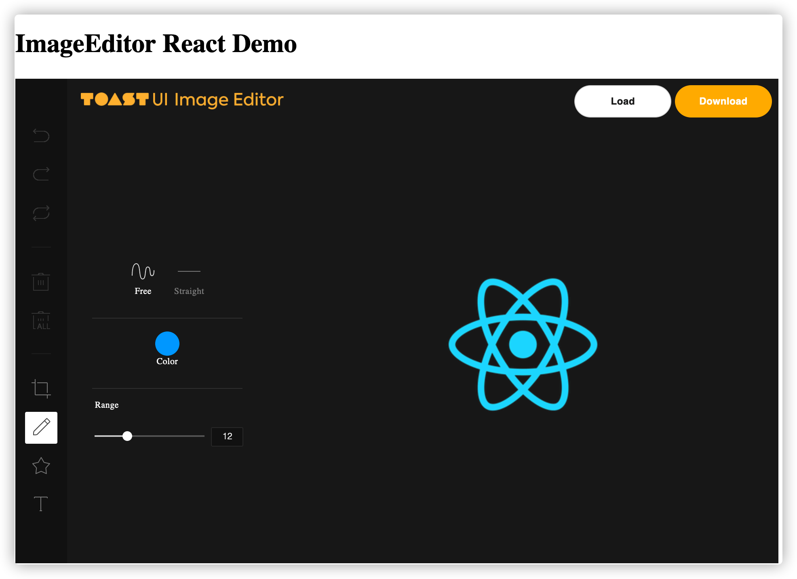

【导语】ToastUI Image Editor 是一个基于 HTML5 Canvas 的 图片编辑器，它使用起来非常简单，而且内置了丰富的图片编辑功能。

## 简介

ToastUI Image Editor 是一个基于 HTML5 Canvas 的 图片编辑器，它使用起来非常简单，而且内置了丰富的图片编辑功能。它支持原生 JavaScript、Vue 组件 和  React 组件三种使用方式。

## 基础使用

### Javascript

最简单的方式安装就是直接取引用它在线的 CDN 资源，我们直接看一个 html 的例子：

```html
<!DOCTYPE html>
<html>

<head>
  <meta charset="UTF-8">
  <title>ImageEditor Demo</title>
  <link type="text/css" href="https://uicdn.toast.com/tui-color-picker/v2.2.6/tui-color-picker.css" rel="stylesheet">
  <link rel="stylesheet" href="https://uicdn.toast.com/tui-image-editor/latest/tui-image-editor.css">
  <style>

    html,
    body {
      height: 100%;
      margin: 0;
    }
  </style>
</head>

<body>

  <div id="tui-image-editor-container"></div>
  <!-- 依赖的第三方库 -->
  <script type="text/javascript" src="https://cdnjs.cloudflare.com/ajax/libs/fabric.js/3.6.0/fabric.js"></script>
  <!-- 一些工具函数 -->
  <script type="text/javascript" src="https://uicdn.toast.com/tui.code-snippet/v1.5.0/tui-code-snippet.min.js"></script>
  <!-- 颜色选择 -->
  <script type="text/javascript" src="https://uicdn.toast.com/tui-color-picker/v2.2.6/tui-color-picker.js"></script>
  <!-- 文件下载的库 -->
  <script type="text/javascript" src="https://cdnjs.cloudflare.com/ajax/libs/FileSaver.js/1.3.3/FileSaver.min.js"></script> 
  <!-- 核心库 -->
  <script src="https://uicdn.toast.com/tui-image-editor/latest/tui-image-editor.js"></script>
  <script>
    var imageEditor = new tui.ImageEditor('#tui-image-editor-container', {
      includeUI: {
        initMenu: 'filter',
        menuBarPosition: 'left'
      },
      cssMaxWidth: 700,
      cssMaxHeight: 500,
      usageStatistics: false
    });
    window.onresize = function () {
      imageEditor.ui.resizeEditor();
    }
  </script>
</body>

</html>
```

我们可以看到，引入了很多 CDN 资源，每个资源的作用都有解释。我们来看一下这个编辑器都使用。

首先我们实例化了一个 `ImageEditor` 类，它第一个参数是**挂载点**，这里表示将编辑器挂载到 id 为 `tui-image-editor-container` 的元素上；接着第二个参数是这个编辑器的属性，下面是对属性的简单介绍：

- `includeUI`：表示使用它内置的 UI 控件
  - `initMenu`：表示编辑器加载后，第一个被选中的操作菜单，这里选的是 `filter`，也就是滤镜
  - `menuBarPosition`：表示菜单栏的位置，有四个选项可选：`'top', 'bottom', 'left', 'right'`
- `cssMaxWidth`：编辑器 Canvas 的最大宽度
- `cssMaxHeight`：编辑器 Canvas 的最大高度
- `usageStatistics`：是否开启 GA （Google Analytics）来收集数据。它是默认开启的，不想使用的话可以设置为 `false`

还有一些属性我们会在后面用到。**这里要注意，无论是原生 JavaScript 的使用方式，还是 Vue、React 的组件使用方式，他们的配置属性几乎一致，所以你不用担心要根据不同情况修改配置的问题。** 实际上，Vue、React 组件就是对这个原生方式的一层包装，本质上是一回事。

介绍完了，我们先来看看上面例子的运行效果：


我们来感受一下它强大的功能吧！


可以看到，当我们加载一张图片进入工作区的时候，默认高亮开启的操作是最后一个滤镜（filter）的操作，我们对图片进行了滤镜、添加文字、添加图标、镜像翻转、裁剪等操作后，点击 Download 下载了我们操作后的图片。只是简单的几行代码，就能实现如此强大的图片编辑功能，是不是很神奇！接下来我们看看，如何在我们的前端框架中集成它。

### Vue

我们使用 vue-cli 搭建一个简单的项目，然后安装 `tui-image-editor`：

```bash
npm install --save @toast-ui/vue-image-editor
```

接着我们在 App.vue 中使用这个组件：

```html
<template>
  <div id="app">
    <ImageEditor :include-ui="useDefaultUI" :options="options"></ImageEditor>
  </div>
</template>

<script>
// 引入样式
import "tui-image-editor/dist/tui-image-editor.css";
import "tui-color-picker/dist/tui-color-picker.css";
// 引入组件
import ImageEditor from "@toast-ui/vue-image-editor/src/ImageEditor.vue";
import Logo from "@/assets/logo.png";

export default {
  name: "App",
  components: {
    ImageEditor,
  },
  data() {
    return {
      useDefaultUI: true,
      options: {
        includeUI: {
          // 默认开启绘图的功能
          initMenu: "draw",
          // 支持的菜单
          menu: [
            "crop",
            "draw",
            "icon",
            "text",
          ],
          // 菜单位置在下面
          menuBarPosition: "bottom",
          // 默认加载的图片
          loadImage: {
            // 图片路径
            path: Logo,
            // 图片的名字，可以省略
            name: "sample",
          },
        },
      },
    };
  },
};
</script>

<style>
html,
body {
  height: 100%;
  margin: 0;
}
#app {
  height: 100%;
}
</style>
```


可以看到，我们新加了 loadImage 的配置，它表示默认加载的图片；又新加了一个 menu 的配置，它的值是一个数组，表示我们需要的功能菜单，如果没有配置的话，默认是开启所有功能。我们运行 `npm run serve` 看一下效果：


果然，我们的功能菜单只有四个了。

全部的功能菜单如下：

```js
 menu: [
  "crop", // 裁切
  "flip", // 翻转
  "rotate", // 旋转
  "draw", // 添加绘画
  "shape", // 添加形状
  "icon", // 添加图标
  "text", // 添加文本
  "mask", // 添加覆盖
  "filter", // 添加滤镜
],
```

可以根据项目的具体需要来进行适当的增减。

### React

在 React 使用也很简单，我们可以基于 `create-react-app` 创建一个简单的项目，然后安装依赖：

```bash
npm install --save @toast-ui/react-image-editor
```

我们接着在 App.js 中使用组件：

```js
import 'tui-image-editor/dist/tui-image-editor.css'
import ImageEditor from '@toast-ui/react-image-editor'

function App() {
  return (
    <div className="App">
      <h1>ImageEditor React Demo</h1>
      <ImageEditor
        includeUI= {{
          initMenu: "draw",
          menu: ["crop", "draw", "icon", "text"],
          menuBarPosition: "left",
          loadImage: {
            path: 'logo192.png',
            name: "sample",
          },
          uiSize: {
            height: '600px'
          },
        }}
        />
    </div>
  );
}

export default App;
```

我们的配置项与上例中 Vue 组件的方式基本一致。运行 `npm start` 看一下效果，应该与上例一样：



## 进阶用法

了解了基础用法之后，我们来深入的学习一下它的其他功能。掌握这些之后，在实际项目中用到它就可以游刃有余了。注意，这里的例子都会以 Vue 组件的形式来介绍，其他方式的使用可以类比。

### 本地化（国际化）

这个 `tui-image-editor` 组件默认是英文的，所以它的各种提示信息也都是英文的。我们平时的使用场景大都是中文的环境，所以做好这些信息的本地化转换是很有必要的。`tui-image-editor` 也提供了相关的配置，我们只要补充需要翻译的文本就可以了。接着上面 Vue 的例子来看一下如何配置：

```html
<script>
import "tui-image-editor/dist/tui-image-editor.css";
import "tui-color-picker/dist/tui-color-picker.css";
import ImageEditor from "@toast-ui/vue-image-editor/src/ImageEditor.vue";
import Logo from "@/assets/logo.png";

const localeCN = {
  Crop: "裁剪",
  Draw: "涂鸦",
  Icon: "添加图标",
  Text: "添加文本",
  Free: "任意线条",
  Straight: "直线",
  Color: "颜色",
  Range: "范围",
};

export default {
  name: "App",
  components: {
    ImageEditor,
  },
  data() {
    return {
      useDefaultUI: true,
      options: {
        includeUI: {
          initMenu: "draw",
          menu: ["crop", "draw", "icon", "text"],
          menuBarPosition: "bottom",
          locale: localeCN,
          loadImage: {
            path: Logo,
            name: "sample",
          },
        },
      },
    };
  },
};
</script>
```

我们添加了 `includeUI.locale` 属性，来看一下效果：


我们看到了，菜单的悬浮提示，和编辑图片的提示都变成了中文。完整的本地化的 Key 值列表可以参考 [tui-image-editor localization](https://github.com/nhn/tui.image-editor/blob/master/docs/Basic-Tutorial.md#5-localization)，你可以根据项目情况进行修改。

### 主题

如果你不喜欢它这个样式，你可以自己定制一份。它的配置类似于上面的本地化配置，也是提供一组 key-value 的映射对象。比如我们继续在上面的例子上添加主题配置：

```html
<script>
import "tui-image-editor/dist/tui-image-editor.css";
import "tui-color-picker/dist/tui-color-picker.css";
import ImageEditor from "@toast-ui/vue-image-editor/src/ImageEditor.vue";
import Logo from "@/assets/logo.png";

const localeCN = {
  Crop: "裁剪",
  Draw: "涂鸦",
  Icon: "添加图标",
  Text: "添加文本",
  Free: "任意线条",
  Straight: "直线",
  Color: "颜色",
  Range: "范围",
};

const customTheme = {
  // 菜单-普通状态 - 绿色
  "menu.normalIcon.color": "green",
  // 菜单-选中状态 - 蓝色
  "menu.activeIcon.color": "blue",
  // 菜单-禁用状态 - 灰色
  "menu.disabledIcon.color": "grey",
  // 菜单-鼠标悬浮状态 - 黄色
  "menu.hoverIcon.color": "yellow",
  // 整体背景颜色
  "common.backgroundColor": "#eaeaea",
  // 头部的背景颜色
  "header.backgroundColor": "#556677",
  // 下载按钮背景颜色
  "downloadButton.backgroundColor": "lightgreen",
  // 下载按钮文字颜色
  "downloadButton.color": "#fff",
  // 下载按钮边框样式
  "downloadButton.border": "none",
};

export default {
  name: "App",
  components: {
    ImageEditor,
  },
  data() {
    return {
      useDefaultUI: true,
      options: {
        includeUI: {
          initMenu: "draw",
          menu: ["crop", "draw", "icon", "text"],
          menuBarPosition: "bottom",
          locale: localeCN,
          loadImage: {
            path: Logo,
            name: "sample",
          },
          theme: customTheme,
        },
      },
    };
  },
};
</script>
```

我们添加了一组样式到 `includeUI.theme` 属性上，来看看效果：


完整的样式主题可以参考源码中 [src/js/ui/theme/standard.js](https://github.com/nhn/tui.image-editor/blob/master/src/js/ui/theme/standard.js) 文件。


如果你想要修改他的 icon 文件的话，可以参考这个链接 [menu-submenu-svg-icon-setting](https://github.com/nhn/tui.image-editor/blob/master/docs/Basic-Tutorial.md#4-menu-submenu-svg-icon-setting)，要注意的是要考虑到每个状态下的icon（normal，active，disable，hover）。

### 方法调用

`tui-image-editor` 也提供了许多内置的方法，方便我们自己处理一些逻辑。它的方法列表文档可以参考：[http://nhn.github.io/tui.image-editor/latest/ImageEditor/](http://nhn.github.io/tui.image-editor/latest/ImageEditor/)

我们继续修改上面的例子，这次我们增加几个外部的按钮，来自己手动的操作图片：

```html
<template>
  <div id="app">
    <ImageEditor ref="editor" :include-ui="useDefaultUI" :options="options"></ImageEditor>
    <div class="actions">
      <button @click="addText">Add Text</button>
      <button @click="rotate">Rotate</button>
      <button @click="flip">Flip Y</button>
      <button @click="undo">Undo</button>
    </div>
  </div>
</template>

<script>
import "tui-image-editor/dist/tui-image-editor.css";
import "tui-color-picker/dist/tui-color-picker.css";
import ImageEditor from "@toast-ui/vue-image-editor/src/ImageEditor.vue";
import Logo from "@/assets/logo.png";

const localeCN = {
  Crop: "裁剪",
  Draw: "涂鸦",
  Icon: "添加图标",
  Text: "添加文本",
  Free: "任意线条",
  Straight: "直线",
  Color: "颜色",
  Range: "范围",
};

const customTheme = {
  // 菜单-普通状态 - 绿色
  "menu.normalIcon.color": "green",
  // 菜单-选中状态 - 蓝色
  "menu.activeIcon.color": "blue",
  // 菜单-禁用状态 - 灰色
  "menu.disabledIcon.color": "grey",
  // 菜单-鼠标悬浮状态 - 黄色
  "menu.hoverIcon.color": "yellow",
  // 整体背景颜色
  "common.backgroundColor": "#eaeaea",
  // 头部的背景颜色
  "header.backgroundColor": "#556677",
  // 下载按钮背景颜色
  "downloadButton.backgroundColor": "lightgreen",
  // 下载按钮文字颜色
  "downloadButton.color": "#fff",
  // 下载按钮边框样式
  "downloadButton.border": "none",
};

export default {
  name: "App",
  components: {
    ImageEditor,
  },
  data() {
    return {
      useDefaultUI: true,
      options: {
        includeUI: {
          initMenu: "draw",
          menu: ["crop", "draw", "icon", "text"],
          menuBarPosition: "bottom",
          locale: localeCN,
          loadImage: {
            path: Logo,
            name: "sample",
          },
          theme: customTheme,
        },
      },
    };
  },
  methods: {
    addText() {
      // 添加文字 Hello Jerry
      // 默认在工作区的中间
      // 文字填充颜色 - 红色；文字大小 22px；
      this.$refs.editor.invoke("addText", "Hello Jerry", {
        styles: {
          fontSize: 22,
          fill: "red",
        },
      });
    },
    // 旋转 20 度
    rotate() {
      this.$refs.editor.invoke("rotate", 10);
    },
    // 沿 Y 轴翻转
    flip() {
      this.$refs.editor.invoke("flipY");
    },
    // 撤销上一次操作
    undo() {
      this.$refs.editor.invoke("undo");
    },
  },
};
</script>

<style>
html,
body {
  height: 100%;
  margin: 0;
}
#app {
  height: 80%;
}
button {
  height: 30px;
  line-height: 30px;
  margin: 30px;
}
</style>

```

我们添加了四个操作按钮，分别是 添加文字，旋转，沿Y轴翻转，撤销，来看一下效果：


可以看到，与我们在编辑器内的操作无异。其实编辑器内几乎所有的操作，我们都可以使用方法调用的方式自己实现。这样，我们就可以充分的发挥自由性，结合需求自己封装出一个更贴合实际的组件。

### 事件监听

Vue 组件提供了如下的事件监听：

- addText: 添加文字
- mousedown: 鼠标按下
- objectActivated: Canvas 中 有元素被选中
- objectMoved: Canvas 中有元素移动
- objectScaled: 元素缩放
- redoStackChanged: 操作栈中的 redo 事件
- textEditing: 文字编辑
- undoStackChanged: 操作栈中的 undo 事件


我们在上面的例子上添加几个监听事件：

```html
<template>
  // .....
  <ImageEditor
    ref="editor"
    @addText="onAddText"
    @textEditing="onEditText"
    @objectMoved="onObjectMove"
    :include-ui="useDefaultUI"
    :options="options"
  ></ImageEditor>
</template>

<script>
export default {
  // ....
  methods: {
    onAddText(pos) {
      console.info(`Adding Text on (${pos.originPosition.x}, ${pos.originPosition.y})`);
    },
    onEditText() {
      console.info("Text Editing");
    },
    onObjectMove(e) {
      console.info(`Object moving... `, e);
    }
  }
}
</script>

```

来看一下效果：


通过控制台的日志可以看到，我们的事件回调函数都被触发了。更多事件的使用方法请参考 [官方文档](http://nhn.github.io/tui.image-editor/latest/ImageEditor#event-addObjectAfter)